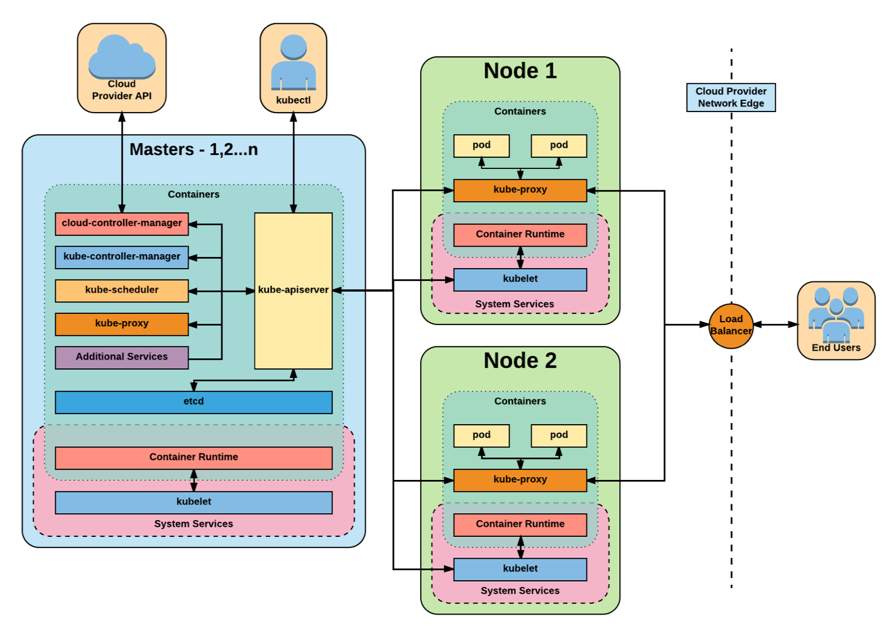
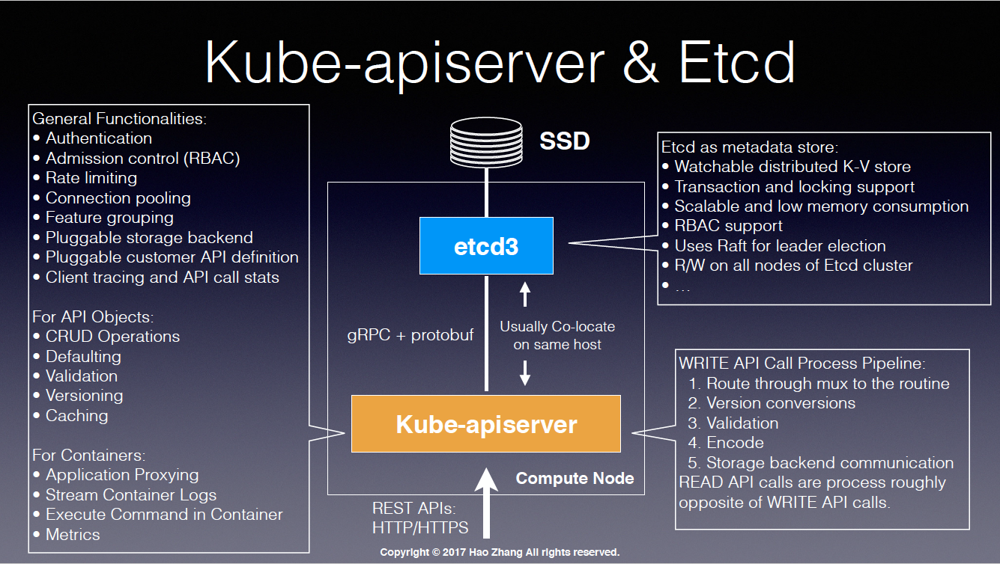
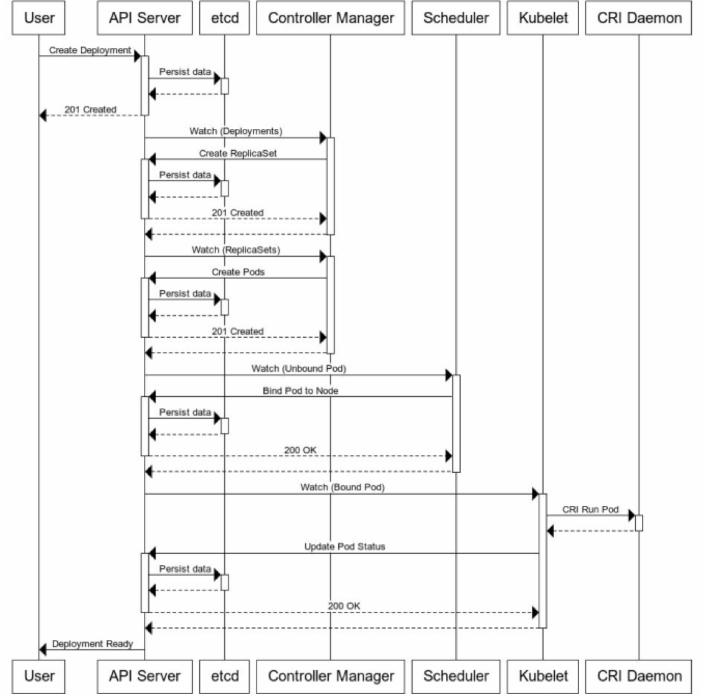

# Chapter 11 쿠버네티스 내부

## 11.1 아키텍처 이해

### Control Plane Component
 - etcd 분산 스토리지
 - API 서버
 - Scheduler
 - Controller Manager

### Worker Node Component
 - Kubelet
 - kube-proxy
 - Container Runtime

 ### Add-on Component
  - 쿠버네티스 DNS 서버
  - 대시보드
  - 인그레스 컨트롤러
  - Heapster
  - Container Network Interface Plugin

## Component Architecture


[kubernetes : From beginner to Advanced](https://www.slideshare.net/InhoKang2/kubernetes-from-beginner-to-advanced) by inho kang


## Components - Detail - from Master to Node
[Kubernetes - Beyond a Black Box](https://www.slideshare.net/harryzhang735/kubernetes-beyond-a-black-box-part-1) by Hao Zhang
 - 위의 장표의 설명을 기반으로 각 컴포넌트 마다의 소스코드 설명을 추가한다. 

### 1. API 서버 
 - Debugging 방법 

### 2. Controller Manager
 - ShareInfomer


 > Controller List source code 


### 3. Watch를 이용한 이벤트 모델 이해

### 4. Deployment 발생시 Sequence Diagram을 이용한 컴포넌트간의 연동관계 이해
 

### 6. 스케줄러 소스


### 7. etcdctl 시연?


### 8. kubelet ?


### 9. Networking

### 10. Kube Proxy & Service


## from place Deployment to create pod 
- 표준 Nginx Deployment to create pod 

some source code
```go
// In pkg/deployment/depolyment_controller.go
// NewDeploymentController creates a new DeploymentController.
func NewDeploymentController(dInformer appsinformers.DeploymentInformer, rsInformer appsinformers.ReplicaSetInformer, podInformer coreinformers.PodInformer, client clientset.Interface) (*DeploymentController, error) {
	eventBroadcaster := record.NewBroadcaster()
	eventBroadcaster.StartLogging(klog.Infof)
    eventBroadcaster.StartRecordingToSink(&v1core.EventSinkImpl{Interface: client.CoreV1().Events("")})
.........    
    dInformer.Informer().AddEventHandler(cache.ResourceEventHandlerFuncs{
            AddFunc:    dc.addDeployment,
            UpdateFunc: dc.updateDeployment,
            // This will enter the sync loop and no-op, because the deployment has been deleted from the store.
            DeleteFunc: dc.deleteDeployment,
        })

// in pkg/deployment/sync.go

// Returns a replica set that matches the intent of the given deployment. Returns nil if the new replica set doesn't exist yet.
// 1. Get existing new RS (the RS that the given deployment targets, whose pod template is the same as deployment's).
// 2. If there's existing new RS, update its revision number if it's smaller than (maxOldRevision + 1), where maxOldRevision is the max revision number among all old RSes.
// 3. If there's no existing new RS and createIfNotExisted is true, create one with appropriate revision number (maxOldRevision + 1) and replicas.
// Note that the pod-template-hash will be added to adopted RSes and pods.
func (dc *DeploymentController) getNewReplicaSet(d *apps.Deployment, rsList, oldRSs []*apps.ReplicaSet, createIfNotExisted bool) (*apps.ReplicaSet, error) {

    // new ReplicaSet does not exist, create one.
	newRSTemplate := *d.Spec.Template.DeepCopy()
	podTemplateSpecHash := controller.ComputeHash(&newRSTemplate, d.Status.CollisionCount)
	newRSTemplate.Labels = labelsutil.CloneAndAddLabel(d.Spec.Template.Labels, apps.DefaultDeploymentUniqueLabelKey, podTemplateSpecHash)
	// Add podTemplateHash label to selector.
	newRSSelector := labelsutil.CloneSelectorAndAddLabel(d.Spec.Selector, apps.DefaultDeploymentUniqueLabelKey, podTemplateSpecHash)

	// Create new ReplicaSet
	newRS := apps.ReplicaSet{
		ObjectMeta: metav1.ObjectMeta{
			// Make the name deterministic, to ensure idempotence
			Name:            d.Name + "-" + podTemplateSpecHash,
			Namespace:       d.Namespace,
			OwnerReferences: []metav1.OwnerReference{*metav1.NewControllerRef(d, controllerKind)},
			Labels:          newRSTemplate.Labels,
		},
		Spec: apps.ReplicaSetSpec{
			Replicas:        new(int32),
			MinReadySeconds: d.Spec.MinReadySeconds,
			Selector:        newRSSelector,
			Template:        newRSTemplate,
		},
	}
	allRSs := append(oldRSs, &newRS)
	newReplicasCount, err := deploymentutil.NewRSNewReplicas(d, allRSs, &newRS)
	if err != nil {
		return nil, err
	}

	*(newRS.Spec.Replicas) = newReplicasCount
	// Set new replica set's annotation
	deploymentutil.SetNewReplicaSetAnnotations(d, &newRS, newRevision, false)
	// Create the new ReplicaSet. If it already exists, then we need to check for possible
	// hash collisions. If there is any other error, we need to report it in the status of
	// the Deployment.
	alreadyExists := false
	createdRS, err := dc.client.AppsV1().ReplicaSets(d.Namespace).Create(&newRS)

}
```


 - 결국 sync에 새로운 replicaset을 생성하는 소스가 있었다. 

