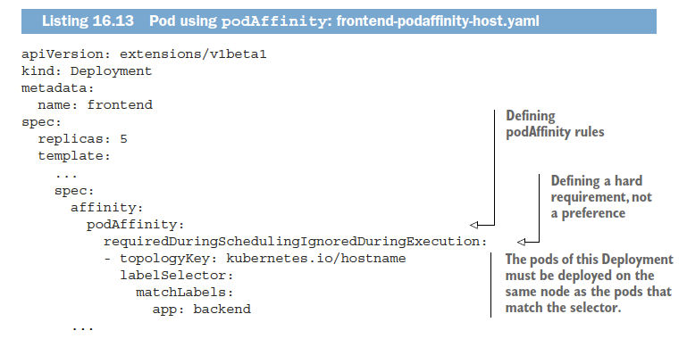

# Chapter 16 Advanced Scheduling

초기의 노드 셀렉터를 지정하는 방식에서 진화해서 Node Spec의 taint와 Pod Spec의 toleration을 이용해서 특정 노드에 포드 실행

ex: nodeSelector
```yaml
apiVersion: v1
kind: Pod
metadata:
  name: nginx
  labels:
    env: test
spec:
  containers:
  - name: nginx
    image: nginx
    imagePullPolicy: IfNotPresent
  nodeSelector:
    disktype: ssd
```
특정 파드가 있는 곳이나 노드에 affinity를 이용해서 배포
```yaml
apiVersion: v1
kind: Pod
metadata:
  name: with-node-affinity
spec:
  affinity:
    nodeAffinity:
      requiredDuringSchedulingIgnoredDuringExecution:
        nodeSelectorTerms:
        - matchExpressions:
          - key: kubernetes.io/e2e-az-name
            operator: In
            values:
            - e2e-az1
            - e2e-az2
      preferredDuringSchedulingIgnoredDuringExecution:
      - weight: 1
        preference:
          matchExpressions:
          - key: another-node-label-key
            operator: In
            values:
            - another-node-label-value
  containers:
  - name: with-node-affinity
    image: k8s.gcr.io/pause:2.0
```
[참조- nodeSelector and affinity ](https://kubernetes.io/docs/concepts/configuration/assign-pod-node/)

## 16.1 taint(오염, 얼룩)와 toleration(허용)을 이용해서 특정 노드에 포드 실행 제한하기 
 - taint와 toleration을 이용해 특정노드에 포드의 실행 여부를 통제
 - NodeSelector나 Affinity는 Pod에 정보를 추가해서 특정 노드에 pod가 스케줄되도록 하는데 반해서, taint는 pod의 정보를 변경하지 않고 node에 정보를 추가해서 특정 노드에 pod가 배포되지 않도록 한다. 
 
 - taint된 노드에 pod를 배포하려면 toleration을 추가해야하는 반면, nodeSelector는 특정 노드를 특정해야 한다. 
 
 
 >둘의 차이점은 nodeSelector는 특정 노드를 지정하기 때문에 Scheduler가 자원활용률등을 고려해서 Pod를 배정하는 것이 아닌 반면, taint와 toleration을 사용하면, 여러 노드중에서 Scheduler의 Rule(자원 활용률)에 따라 배정할 수 있는 장점이 있다.  


### 16.1.1 taint와 toleration
테이트와 톨러레이션을 이해하는 가장 좋은 방법은 직접 살펴보는 것이다. 


> taint 구조 : `<key>=<value>:<effect>`
> key = `node-role.kubernetes.io/master`, value = `null`, effect = `NoSchedule`
> 이 taint는 pod가 taint를 tolerate(허용)하지 않는한, master 노드에 스케줄링 되지 못하게 한다. 


#### Pod의 Toleration 출력하기 


실제로 테스트한 바는 아래처럼 `master=:NoSchedule`과는 다른다. 아마도 버전 차이일듯(테스트 버전 1.12)


#### taint effect
kube-proxy pod에는 노드가 `not-ready`와 `unreachable`로 설정되어 있을 때 pod가 얼마나 오래 실행될 수 있는지 toleration이 설정되어 있다. 

taint에는 3가지 effect가 있다. 
 - `NoSchedule`, which means pods won’t be scheduled to the node if they don’t tolerate
the taint.
 - `PreferNoSchedule` is a soft version of NoSchedule, meaning the scheduler will
try to avoid scheduling the pod to the node, but will schedule it to the node if it
can’t schedule it somewhere else.
 - `NoExecute` : NoSchedule와 PreferNoSchedule가 스케줄링에만 영향을 미치는데 반해서, NoExecute는 이미 실행 중인 Pod에도 영항을 미친다.  노드에 NoExecute taint를 추가하면, 실행중인 Pod를 제거한다. (단, toleration로 NoExecute taint를 설정한 경우는 제외)

### 16.1.2 노드에 사용자 정의 taint 추가
하나의 k8s 클러스터에서 Production 환경과 Non-Production환경을 함께 운영중인 경우, `즉 특정 노드는 Production으로 사용하고 일부 노드는 Non-Prodcution으로 사용하는 경우` Non-Production pod가 Prodcution node환경에 실행되지 않도록 해야 한다. 


``` bash
$ kubectl taint node node1.k8s node-type=prodcution:Noshedule
```


`배포하는 pod toleration을 추가하지 않았기 때문에`, node1.k8s에는 배포가 되지 않았다.

#### 16.1.3 pod에 toleration 추가


node1에 배포되는 것 확인

#### 16.1.4 taint와 toleration 활용방안
노드는 여러개의 taint를 가질 수 있으며 Pod 또한 여러개의 toleration을 가질 수 있다. 

taint는 key와 effect는 꼭 있어야 하지만 value의 값은 꼭 필요하지는 않는다. 그러나 toleration는 `Equal`또는 `Exist` 같은 operation을 사용하기 때문에 key에 대한 value가 꼭 필요하다. 
위의 Pod의 toleration 참조 


##### 스케줄링시에 taint와 toleration 이용

Taint를 이용해서 특정 노드에 포드가 스케줄되지 않도록 (NoSchedule effect)하거나 되도록 안되게 하거나(PreferNoSchedule effect) 또는 실행중 포드까지 중지 시키게 (NoExecute effect) 할 수 있다. 

이 taint와 toleration을 잘 조합하면, 여러분의 요구에 딱 맞도록 조절할 수 있다. 
예를 들어 하나의 클러스트에서 개발팀만 사용하는 노드를 특정하거나, 특수한 하드웨어에는(GPU, SSD) 특정한 Pod가 배포되도록 할 수 있다. 

##### 노드가 failure 되고난 뒤에 얼마나 있다가 pod를 다시 스케줄링될 것인가를 설정
Node가 장애가 나서 node가 `not-ready`나 `unreachable`된 이후에 얼마나 대기했다가 pod를 다시 스케줄링할 것 인가를 toleration의 `tolerationSeconds`를 이용해 설정할 수 있다. 


설정하지 않으면 위의 두가지가 default으로 추가되며, 5분이 길다면 줄일 수도 있다. 

> 확인 필요 : 책에서는 현재는 알파버전이다. 


### 16.2 노드 친화성을 사용해 특정 노드로 포드 유인하기
taint가 노드를 특정노드에서 멀리하도록 하는데 사용됐다면, node affinity는 그 반대의 메커니즘을 제공한다. 

#### node affinity vs node selector
초기에 node affinity 메커지즘은 Pod Spec에 node selector필드를 이용하는 방법이었고, Pod에 node selector 필드에 기술된 모든 lable을 Node가 가지고 있어야 pod가 스케줄된다. 

node selector는 초기의 요구사항을 잘 처리했지만, 다양한 요구사항이 나오면서 결국에는 deprecated될것이고(아직도 will eventually deprecated로 나옴 2019,7,8) node affinity rule로 대체될 것이다. 

node affinity 도 node selector와 마찬가지로 rule을 정의할 수 있는,hard requirement(엄격한 요구사항)과 affinity(선호도)를 정의할 수 있다. 
이를 바탕으로 k8s가 pod를 선호도(Preference) 기반으로 특정 node에 스케줄을 시도하지만, 특정 node에 배정이 불가하면 다른 node에 배정하게 된다. 말 그대로 `Preference 선호도` 이다. 

##### Default Node Lablel
Node affinity도 Node selector와 같이 Label 기반으로 Node를 선정한다. 

여러 Lable이 있지만 마지막 3개를 보면
 - failure-domain.beta.kubernetes.io/region specifies the geographical region
the node is located in.
 - failure-domain.beta.kubernetes.io/zone specifies the availability zone the
node is in.
 - kubernetes.io/hostname is obviously the node’s hostname.

### 16.2.1 Hard node affinity rule
3장에서 처럼 node selector를 이용한 gpu : "true" 


##### node affinity


 - requiredDuringScheduling... : 스케줄 될때 사용될 rule을 정의 
 - ...IgnoredDuringExecution : 이미 실행중인 pod에는 영향을 주지 않는다. 

 > 현재는 실행중인 Pod에는 영향을 주지 않기 때문에 모든 affinity rule이 `IgnoredDuringExecution`이지만 결국 k8s가 실행중인 Pod에도 영향을 줄 수 있도록 `RequiredDuringExecution`을 지원할 것이다. (현재도 지원 안되는 것으로 보인다. -2019.07.08)


##### Understanding NodeSelectorTerms
nodeSelectorTerms 와 matchExpressions 를 이용해서 정의


#### 16.2.2. 포드를 스케줄링할 때 노드의 우선순위 지정
노드 affinity의 가장 큰 장점은 특정 포드를 스케줄링할 때 스케줄러가 선호하는 노드를 지정할 수 있다. 이것이 preferredDuringSchedulingIgnoredDuringExecution 필드이다. 

예를 들어서 한 회사가 여러 나라에 걸쳐서 여러 Availity zone을 가지고 있고, 각 AZ에는 그 회사만을 위한 Node와 파트너 시스템를 위한 Node가 있다고 가정하자. 

특정 서비스를 런칭하면서 Pod를 배포할때 되도록 같은 zone에 배포되고, 그 회사만의 dedicated node에 배포되는걸 선호하지만, 필요에 따라서는 파트너용 node에 배포되도 된다. 

#### node labeling
이걸 위해서는 node에 zone과 dedicated를 나타내는 label을 추가한다. 


#### node affinity rule 정의


#### UNDERSTANDING HOW NODE PREFERENCES WORK


#### DEPLOYING THE PODS IN THE TWO-NODE CLUSTER


생성된 5개중 4개가 node1에 배포되고 node2에 1개가 배포되는 이유는?
노드 선호도 우선순위 지정 기능 외에도 스케줄러는 다른 우선순위 기능을 사용해 포드가 스케줄될 위치를 결정한다. 
그중 하나가 SelectorSpreadPriority 기능이다. 동일한 ReplicaSet이나 Service가 같은 노드에 배포되지 않도록 해서 노드의 장애에 대응하도록 하는 기능이다. 


### 16.3 포드 친화성 및 반친화성으로 포드를 가깝게 위치하기 
지금까지는 Node와 Pod간의 Affinity를 정의했지만, pod간의 affinity를 지정할 수도 있다. 
예를 들어 front-end와 back-end를 같은 노드에 배치하면 성능향상에 도움이 될것이다. 

### 16.3.1 포드간의 친화성을 사용한 동일한 노드에 배포하기

pod affinity를 정의해서 front-end와 back-end를 같은 노드에 배포해 보자 


back-end pod에 label을 `app=backend`라고 달았다. 

#### front-end pod를 배포하는 Deployment에 pod Affinity 지정


 `topologyKey` field에 `app: backend`  


#### back-end pod와 front-end pod 확인


#### UNDERSTANDING HOW THE SCHEDULER USES POD AFFINITY RULES
back-end pod를 삭제하면, 다시 node2로 스케줄링된다. (back-end pod에는 pod affinity가 정의되어 있지 않다.)

back-end pod가 다른 노드로 스케쥴링 된다면 pod affinity rule이 깨질것이다. 스케줄러의 로깅 수준을 높여서 로그를 확인하면 다름과 같이 Score를 확인할 수 있다. 


### 16.3.2 Deploying pods in the same rack, availability zone, or geographic region

#### CO-LOCATING PODS IN THE SAME AVAILABILITY ZONE & Region
같은 AZ에 위치시키기 위해서는 topologyKey를 failure-domain.beta.kubernetes.io/zone로 설정

같은 Region : failure-domain.beta.kubernetes.io/region.

#### 사용자정의 TopologyKey 

필요한 topologyKey를 정의해서 사용 가능

ex: topologyKey : rack


### 16.3.3 Expressing pod affinity preferences instead of hard requirements

지금까지는 node affinity를 엄격한 요구사항(hare requirement)으로 꼭 그렇게 해야만 하도록 구성하는 것을 봤다면, 지금부터는 선호도(Preference)를 지정해서 되도록 스케줄러가 특정 노드에 파드를 스케줄링 하도록 하지만 어떤 이유에서든 그렇지 못한 경우에는 다른 노드에 스케줄링 할 수 있도록 할 수 있다.

pod affinity :`preferredDuringSchedulingIgnoredDuringExecution` 이 바로 선호도를 주는 키워드 이다. 
vs `requiredDuringSchedulingIgnoredDuringExecution` (hard requirement)


### 16.3.4 Scheduling pods away from each other with pod anti-affinity
anti-affinity로 떨어 뜨리기


예를 들어 두개의 파드가 서로 퍼포먼스 간섭을 일으키는 경우 또는 모든 pod가 각가 다른 노드에 배포되어서 장애에 더욱 견고해 지도록 하려는 의도인 경우


#### USING ANTI-AFFINITY TO SPREAD APART PODS OF THE SAME DEPLOYMENT

각은 파드를 ani-affinity로 설정한 경우


파드가 생성은 되지만 pending으로 된다.  


